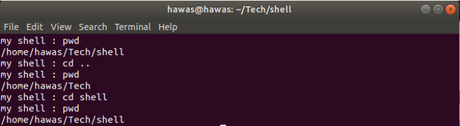
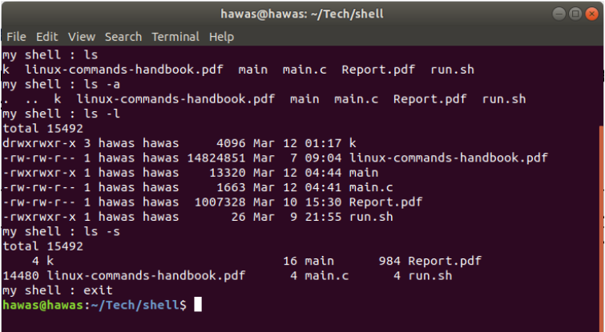
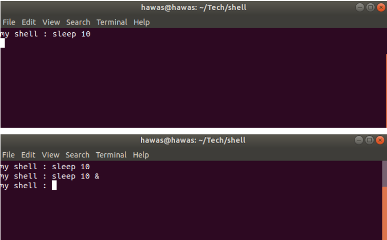

# Simple Shell Implementation in C

This is a basic implementation of a shell in C programming language. It allows users to execute commands, change directories (`cd`), and display the current working directory (`pwd`).

## Features
- Execute shell commands
- Change directories (`cd`)
- Display current working directory (`pwd`)
 
- Run `ls` with parameters
  
 

- `exit` the shell    
 

- Executing process in background using `&` operand 
 


## Usage
1. Compile the program using a C compiler. For example:
    ```
    gcc main.c -o main.o
    ```

2. Run the compiled program:
    ```
    ./main.o
    ```

3. Enter commands in the prompt. Supported commands:
    - Execute any shell command (e.g., `ls`, `echo`, etc.)
    - Change directory: `cd <directory>`
    - Display current working directory: `pwd`
    - Exit the shell: `exit`

## Background Process
You can run a process in the background by appending `&` at the end of the command. For example:
```
ls &
```

## Notes
- This shell does not support input/output redirection or piping.
- Use Ctrl+C to send an interrupt signal to the running process.
- Use Ctrl+D or type `exit` to exit the shell.

