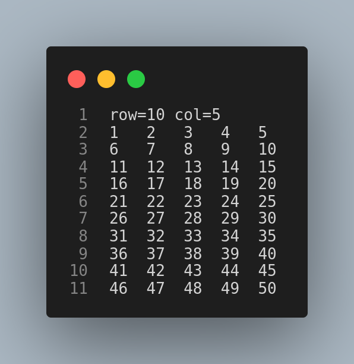
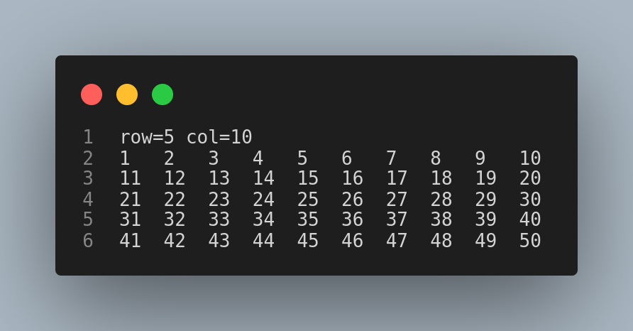
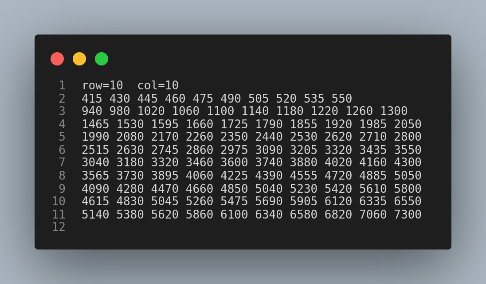

# Operating System Lab 2: Matrix Multiplication (Multi-Threading)

## 1. Objectives
- To get familiar with thread programming using the Pthread library.
- To better understand processes and threads.

## 2. Overview
You are required to implement a multithreaded matrix multiplication program. The input to the program is two matrices A(xy) and B(yz) that are read from corresponding text files. The output is a matrix C(x*z) that is written to an output text file.

A parallelized version of matrix multiplication can be done using one of these three methods:
1. A thread computes the output C matrix i.e. without multi-threading. (A thread per matrix).

2. A thread computes each row in the output C matrix. (A thread per row).
3. A thread computes each element in the output C matrix. (A thread per element).

## 3. Code Organization
The program reads two matrices from files, multiplies them using three different methods, and writes the resulting matrices to output files. The program uses “pthreads” to parallelize the multiplication process. Here is an overview of how the code is organized:

1. The program defines a Matrix struct that holds the dimensions and elements of a matrix.
2. It defines three instances of Matrix: matrix_a, matrix_b, and matrix_c.
3. The program defines three functions to read the contents of the matrices from files and populate the Matrix structs. These functions are read_file, construct, and write_file.
4. The program defines three multiplication functions:
   - `mult_per_matrix`: multiplies matrix_a and matrix_b using the matrix multiplication algorithm and stores the result in matrix_c_per_matrix.
   - `mult_per_row`: multiplies matrix_a and matrix_b using the matrix multiplication algorithm and stores the result in matrix_c_per_row. This function is designed to be run by multiple threads, with each thread computing one row of the result matrix.
   - `mult_per_element`: multiplies matrix_a and matrix_b using the matrix multiplication algorithm and stores the result in matrix_c_per_element. This function is designed to be run by multiple threads, with each thread computing one element of the result matrix.
5. The main function reads the matrices from files using read_file, constructs the matrix_c matrices using construct, and creates the threads to perform the multiplications using pthread_create.
6. After the threads are created, the main function waits for all threads to complete using pthread_join.
7. Finally, the main function writes the resulting matrices to output files using write_file.

## 4. Main Functions
1. `construct(Matrix* matrix, int rows, int cols)`: A function that constructs a matrix with the given number of rows and columns.

2. `void* read_file(void* arg, Matrix* matrix)`: A thread function that reads the matrix data from a file and stores it in the given matrix.

3. `void write_file(Matrix* matrix, char* filename)`: A function that writes the matrix data to a file.

4. `void* mult_per_matrix()`: A thread function that multiplies two matrices (matrix_a and matrix_b) and stores the result in matrix_c_per_matrix.

5. `void* mult_per_row(void* arg)`: A thread function that multiplies two matrices (matrix_a and matrix_b) row by row and stores the result in matrix_c_per_row.

6. `void* mult_per_element(void* arg)`: A thread function that multiplies two matrices (matrix_a and matrix_b) element by element and stores the result in matrix_c_per_element.

## 5. Sample Runs and Comparison
- `a_txt`: Input file containing matrix A data.

- `b_txt`: Input file containing matrix B data.

- `c_txt`: Output file for resulting matrix C for all methods.

